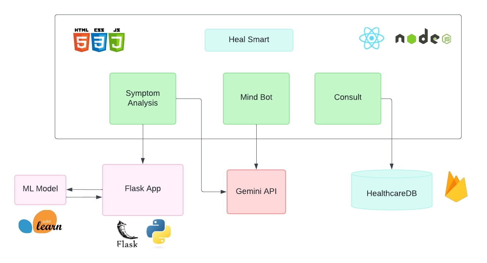

# Student Mind Matters
## Introduction
Mind Matters is an application designed to provide help in diagnosis of various diseases, with help of AI and providing a platform for users to directly connect to a doctor. Includes a Chat bot which allows the users, to describe his symptoms using prompts, making the diagnosises faster.

## Interface
1. AI Consultation Interface

2. Consult Doctor Interface

3. Home Page

4. Mind Bot(Chat Bot)
(without response)

(with response)

5. Symptom Analysis Page

## Architecture
1. Machine Learning Process

2. Overall Tech stack

## Features
1. AI assisted diagnosis using Google Gemini API based on prompts given by the user.
2. Detailed Symptom Analysis

### Upcoming features
- [ ] Available on phone.
- [ ] Free therapy sessions.
- [ ] different page for doctor appointment.
